  

  
  
  

## 🧪 Side projects

**[email-forward-parser-py](https://github.com/felipehertzer/email-forward-parser-py)** · Python 
Forwarded emails are a crime scene: `Fwd: FW: Fwd:`, quoted headers and three different email clients arguing about formatting. This digs out the original sender, recipients, subject and body, from plain text or full `.eml` files.

**[right-click-unlocked](https://github.com/felipehertzer/right-click-unlocked)** · Chrome extension 
For websites that think disabling right-click is a security feature. Brings back right-click, text selection and copy, and ships with MDM policies so IT can push it to a whole fleet.

**[full-name-splitter](https://github.com/felipehertzer/full-name-splitter)** · Python 
Splits `Kevin J. O'Connor` into a first and last name. Humans keep making this harder than it should be.

## 🧰 Toolbox

  <picture>
    <source media="(prefers-color-scheme: dark)" srcset="https://skillicons.dev/icons?i=py%2Cphp%2Cjava%2Cjs%2Cts%2Cswift%2Crust%2Creact%2Cvue%2Ctailwind%2Chtml%2Ccss%2Cdjango%2Cflask%2Claravel%2Cspring%2Cnodejs%2Cpostgres%2Cmysql%2Caws%2Cdocker%2Ckubernetes%2Cgitlab%2Clinux%2Cpytorch%2Ctensorflow%2Carduino&perline=9&theme=dark" />
    
  </picture>

  
  
  
  
  
  

## 📊 Stats

  <picture>
    <source media="(prefers-color-scheme: dark)" srcset="https://github-readme-stats.vercel.app/api?username=felipehertzer&show_icons=true&include_all_commits=true&count_private=true&rank_icon=github&bg_color=0d1117&title_color=58a6ff&icon_color=58a6ff&text_color=c9d1d9&border_color=30363d&border_radius=10&disable_animations=true&cache_seconds=86400" />
    
  </picture>
  <picture>
    <source media="(prefers-color-scheme: dark)" srcset="https://github-readme-stats.vercel.app/api/top-langs/?username=felipehertzer&layout=compact&langs_count=8&bg_color=0d1117&title_color=58a6ff&text_color=c9d1d9&border_color=30363d&border_radius=10&disable_animations=true&cache_seconds=86400" />
    
  </picture>

  <picture>
    <source media="(prefers-color-scheme: dark)" srcset="https://streak-stats.demolab.com/?user=felipehertzer&background=0D1117&border=30363D&stroke=30363D&ring=58A6FF&fire=58A6FF&currStreakLabel=58A6FF&currStreakNum=C9D1D9&sideNums=C9D1D9&sideLabels=8B949E&dates=8B949E&border_radius=10&disable_animations=true" />
    
  </picture>

  <picture>
    <source media="(prefers-color-scheme: dark)" srcset="https://raw.githubusercontent.com/felipehertzer/felipehertzer/output/github-snake-dark.svg" />
    
  </picture>

## 📬 Say hi

Email works best: [felipe@hertzer.net](mailto:felipe@hertzer.net). Please don't forward it, I'll just parse it.
